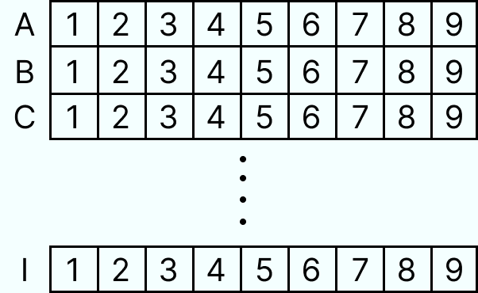

# Quality Assurance App

This is an end-to-end app with five different projects built mainly with JavaScript. The main goal for the app was to practice Test Driven Development. This project is part of the freeCodeCamp curriculum.  

To see the app live [click here](https://quality-assurance-app.onrender.com/).

- [Metric Converter](#metric-imperial-converter)
- [Issue Tracker](#issue-tracker)
- [Personal Library](#personal-library)
- [Sudoku Solver](#sudoku-solver)
- [English Translator](#english-translator)

### [Backend](backend)
The backend was built with Nodejs and Expressjs following the Microservices architecture style, and all APIs follow the REST architectural style.  
The choice for the database was MongoDB and the mongoose library to manage and store the data.  

### [Tests](backend)
As said before, the main goal of this project was to practice TDD. So I used Chai.js to handle all the tests - unit and functional.

### [Frontend](frontend)
The frontend was built using only HTML, Bootstrap, and JavaScript.

## [Metric-Imperial Converter](backend/README.md#metric-imperial-converter)
A simple metric-imperial converter with only 3 basic units of measurement:  
- Length: we can convert Kilometers to Miles and vice-versa.
- Mass: we can convert Kilograms to Pounds and vice-versa.
- Volume: we can convert Liters to Gallons and vice-versa.  
[More details](backend/README.md#metric-imperial-converter)

## [Issue Tracker](backend/README.md#issue-tracker)
The idea behind this project was to create a tool to track issues on a project.  
[More details](backend/README.md#issue-tracker)

## [Personal Library](backend/README.md#personal-library)
A simple library project in which we can store books and keep track of comments on all books.  
[More details](backend/README.md#personal-library)

## [Sudoku Solver](backend/README.md#sudoku-solver)
This is a simple project, and as the name implies, this is a sudoku solver but can also be used to check if a number is valid to be used in a given coordinate - we use coordinates to track all squares in a puzzle.  
[More details](backend/README.md#sudoku-solver)

The game is divided into rows, columns, and areas.
Starting from the fact that the game is a larger area of `9X9` - that gives us `81 squares` to work with:
- Each `row` is composed of 9 squares as well as each `column` and each `area` - in `3x3` format.
- Each `row` receives a letter from `A to I` as a coordinate is the first line - top - the letter `A` and the last line - base - the letter `I`.
- Each `column` receives as a coordinate a number from `1 to 9`, the first column - left, column `1`, and the last column - right - column `9`.

    

## [English Translator](backend/README.md#english-translator)
As the name implies this project work as a translator between british english and north american english.  
[More details](backend/README.md#english-translator)

### [Live App](https://quality-assurance-app.onrender.com/)

## Conclusion
Overall this is not a big project, but I can say I did my best here to write some good code. I had to work with some conditions because this is part of the freeCodeCamp curriculum, and I had to pass all the tests they asked for.  
While working on this project, I studied a lot, not only in terms of TDD, which was the main goal here but backend architecture and OOP concepts.

It was a really good experience.