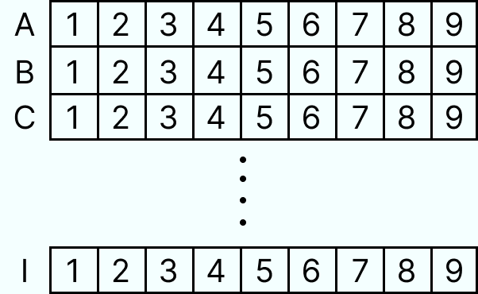

## [Sudoku Solver](https://quality-assurance-app.onrender.com/sudoku-solver)
This is a simple project, and as the name implies is a sudoku solver but can also be used to check if a number is valid to be used in a given coordinate - we use coordinates to track all squares in a puzzle.

The game is divided into rows, columns, and areas.
Starting from the fact that the game is a larger area of `9X9` - that gives us `81 squares` to work with:
- Each `row` is composed of 9 squares, as well as each `column` and each `area` - in `3x3` format.
- Each `row` receives a letter from `A to I` as a coordinate is the first line - top - the letter `A` and the last line - base - the letter `I`.
- Each `column` receives as a coordinate a number from `1 to 9`, the first column - left, column `1`, and the last column - right - column `9`.

<p align="center">
    
</p>

**To get the puzzle solved**, you must send a POST request with a body to `/sudoku-solver/api/v1/solve`.  
The body should be an object with a `puzzle` key and the value should be a string with all the numbers from the puzzle.

***Note: blank spaces should be replaced with `.`***

The following game should have a puzzle string that looks like this: `.7.89.....5....3.4.2..4..1.5689..472...6.....1.7.5.63873.1.2.8.6..47.1..2.9.387.6`.

<p align="center">
    
</p>

In this case, the answer will be an object that looks like this:
```
{
	"message": "Puzzle solved",
	"solution": "473891265851726394926345817568913472342687951197254638734162589685479123219538746"
}
```

**Note:**
- The string must be `81 characteres long`.

**To validate a given value in a given coordinate in the puzzle**, you must send a POST request with a body to `/sudoku-solver/api/v1/check`.  
The body must have 3 key-value pairs: puzzle, coordinate, and value.

**Note:**
- The puzzle must be `81 characters long`.
- Coordinate should be 2 characters long composed of a letter and a number: e.g `A3`.
- The value must be a `number`.

In this case, the answer will be an object:
- If there are no conflicts: `{ "valid": true }`.
- If there are one or more conflicts:
```
{
	"valid": false,
	"conflict": [
		"row",
		"column",
		"region"
	]
}
```
